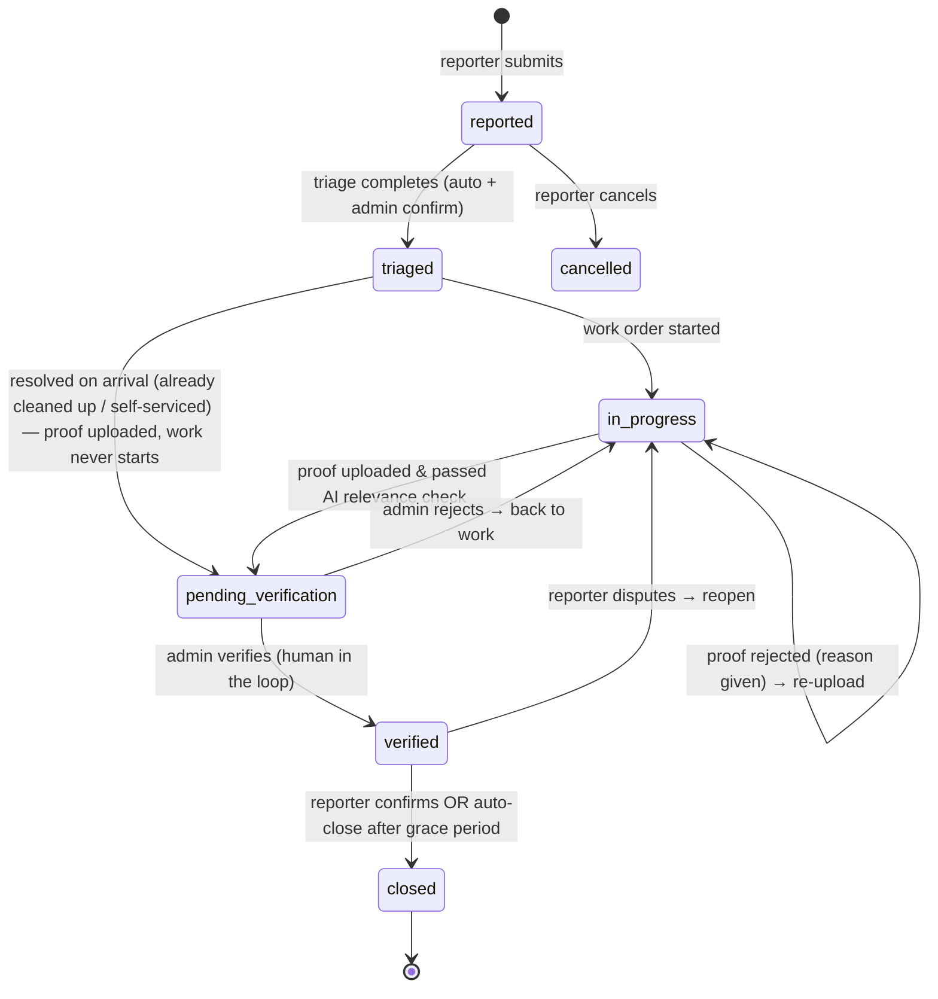

# 00 — Design Overview

## Problem

Facilities defects (aircon faults, broken lights, cleanliness, toilets, physical
security, others) need a reporting loop that is transparent to the reporter and
gives facilities managers macro-level insight, not just a ticket queue.

## The four stages

| Stage | Who | What happens |
|---|---|---|
| 1. User Reporting | Reporter | Submit category, location (building/floor/room — room optional), description. AI suggests a (re-)categorization; reporter's choice is never silently overridden. System returns an expected-resolution estimate ("~X days") based on priority and live open-issue load, so reporters can decide whether to self-resolve. Reporter tracks live status on a dashboard. |
| 2. Triage | System + Admin | AI + heuristics suggest severity and urgency class. Cross-referencing across all issues flags systemic faults (repeat issues on same floor, same equipment, same issue profile) and surfaces them to the admin once with a maintenance recommendation, on the AI insights screen (the admin decides whether to raise it as its own issue; nothing is pushed — see [05 — Triage & Analytics](05-triage-analytics.md) §Systemic escalation), detects duplicates (same defect reported by different users → escalate severity/urgency), and computes MTBF / MTTR metrics. Admin confirms or overrides. |
| 3. Fix & Verify | Maintenance + Admin | A work order is created. The system recommends what proof of work to upload (e.g., before/after thermostat photos for aircon temperature) — a recommendation, never a hard requirement that overrides what the user uploads. Uploaded proof is AI-checked for relevance to the issue description; irrelevant proof is rejected with a stated reason and must be re-uploaded. Issues that cannot be verified visually (e.g., "bad smell at Level 2") are routed to human verification. When proof passes the relevance check, a human (admin) is notified to do final verification. |
| 4. Close Loop | Reporter + Admin | After admin verification the reporter is notified and asked to confirm resolution ("user closed defect"). Auto-close after a grace period if the reporter does not respond. Closure feeds MTTR/MTBF metrics back into triage analytics. |

## Key design decisions (agreed with stakeholder)

| Decision | Choice | Rationale |
|---|---|---|
| AI backend | Self-hosted **OpenAI-compatible vLLM endpoint** (text model + vision model) | Stakeholder hosts it; services use the `openai` client with a configurable base URL. |
| Service split | **One service per stage** (~5 services) + gateway + frontend | Clear mapping to the four stages; teachable microservice boundaries. |
| Database | **One PostgreSQL database, one real schema per service** (`reporting`, `triage`, `fixverify`, `notification`) | Migrated from SQLite for `pg_trgm` fuzzy text search (issue search + duplicate pre-filter). Each service WRITES only its own schema; triage additionally READS the `fixverify` schema because triage needs fix-and-verify data (repair times, proof rejections) for triaging. |
| Auth | **Demo mode** — role picker (Reporter / Maintenance / Admin), no login | PoC scope. Role sent as `X-Role` / `X-User` headers. The role also **scopes what reporting returns** (reporter: own issues; maintenance: `in_progress` onwards; admin: everything) so each role's screens show a coherent slice — presentation, not authorization; see [01 — Architecture](01-architecture.md). |
| Inter-service comms | **Sync REST** for queries/commands + **webhook events** fanned out by the gateway | No broker infra; still demonstrates event-driven flows. |
| Notifications | **In-app only** (notification service + bell/inbox in frontend) | No email infra needed. |
| Reference schema | `example_db_schema.jpeg` (facilities job-request field list) | Adapted, not copied — see [02 — Data Model](02-data-model.md) for the field mapping. |

## Issue lifecycle (status state machine)

## Microservice boundaries across the lifecycle

**Reporting is the single writer of issue state.** Every status transition above
is executed by the reporting service, which enforces the state machine in one
place. The other services *drive* transitions by calling reporting's API — they
never hold their own copy of an issue's status as the source of truth.

| Transition | Driven by | How |
|---|---|---|
| `[*] → reported` | **Reporting** | `POST /issues` (reporter, via frontend). Reporting also runs AI categorization here. |
| `reported → triaged` | **Triage** | Auto-pipeline on the `issue.created` event (admin confirm/override optional) → `POST /issues/{id}/triage-result` on reporting. |
| `[*] → reported` (systemic escalation) | **Triage → Admin → Reporting** | Triage notifies the admin once when a cluster crosses the systemic threshold; the admin decides whether to file an issue, and does so through the ordinary reporter flow under their own name. Triage creates nothing. The triggering ticket is unaffected. See [05](05-triage-analytics.md). |
| `triaged → in_progress` | **Fix & Verify** | Work order created on `issue.triaged` event — unless the issue is a duplicate whose group primary is already being worked, in which case it rides that work order and stays at `triaged` (see [05](05-triage-analytics.md)). Then `POST /work-orders/{id}/start` → reporting status API. |
| `triaged → pending_verification` (resolved on arrival) | **Fix & Verify** | Maintenance arrives and finds the defect already resolved (e.g. a spill someone else cleaned up, or the reporter self-serviced): a proof is uploaded on the still-`open` work order — the AI relevance check and human verification still apply, but `in_progress` is skipped. Work order is marked `resolved_on_arrival`; closure typically uses `resolution_type: self_resolved`. |
| `in_progress → pending_verification` | **Fix & Verify** | Proof upload passes the AI relevance check → reporting status API. |
| proof rejected (stays `in_progress`) | **Fix & Verify** | Vision model verdict `irrelevant` → HTTP 422 to the uploader with the reason; emits `proof.rejected`. No status change. |
| `pending_verification → verified` / `→ in_progress` | **Fix & Verify** | Admin's `POST /proofs/{id}/human-verify` (approve/reject) → reporting status API. |
| `verified → closed` | **Reporting** | `POST /issues/{id}/close` — by the reporter (confirm), an admin, or auto-close after the grace period. |
| `verified → in_progress` (dispute) | **Reporting** | Reporter disputes via the status API; fixverify picks the work order back up. |
| `reported → cancelled` | **Reporting** | `POST /issues/{id}/cancel` by the reporter. |

Boundaries of what each service owns (and explicitly does *not*):

| Service | Owns | Does NOT own |
|---|---|---|
| **Reporting** | The `issues` table, the status state machine, timeline, reference numbers, categorization suggestions. | Severity/urgency *decisions* (it stores what triage tells it), work orders, proofs, notifications. |
| **Triage** | Triage results, its own `issue_facts` analytics snapshot, systemic clusters, MTBF/MTTR. | Issue status — it writes results back through reporting's API only. It reads issues via REST, never reporting's DB. |
| **Fix & Verify** | Work orders, uploaded proof files, AI relevance verdicts, human verification records. | Issue status (requests transitions via reporting), triage decisions, who gets notified. |
| **Notification** | The notification inbox and the event→notification rules. | Any issue/work-order state; it is a pure consumer of events. |
| **Gateway** | Routing and event fan-out (`subscriptions.py`). | No domain data at all — stateless. |

Cross-cutting rule: all services share one PostgreSQL database with a real
schema per service (`reporting`, `triage`, `fixverify`, `notification`). Each
service **writes** only tables in its own schema; commands and state changes
still travel via REST APIs and gateway events. The one sanctioned cross-schema
access: **triage may read the `fixverify` schema** (read-only) to fold
repair-time and proof-quality data into triage analytics
(the `vendor_performance` block of `GET /api/triage`).

## Non-goals (for this PoC)

- Real authentication / SSO, multi-tenancy
- Vendor contract management, costing/chargeback (`Charge to PWO?`, `Costing Required?` from the reference schema are noted in the data-model doc but not implemented)
- Mobile app (the React app is responsive enough for demo)
- Horizontal scaling, HA databases
