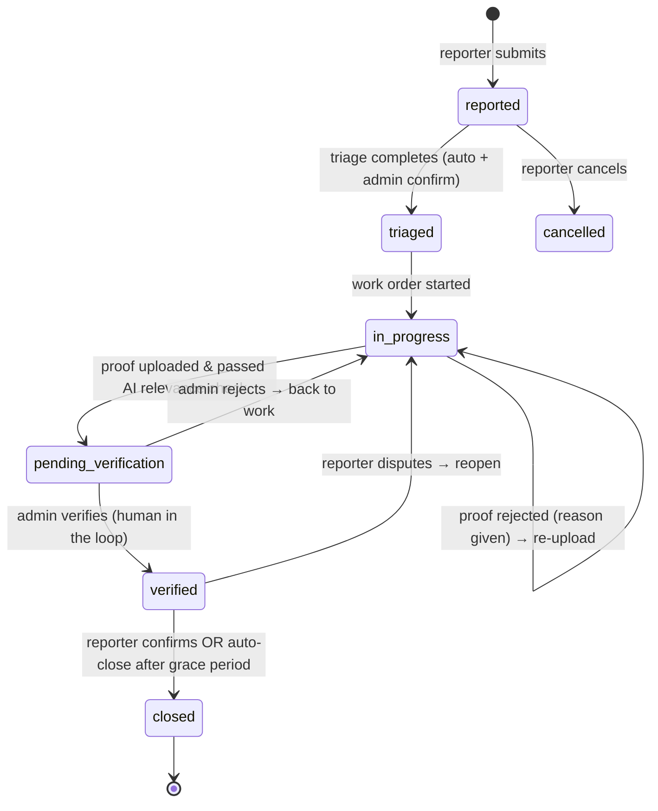

# 00 — Design Overview

## Problem

Facilities defects (aircon faults, broken lights, cleanliness, toilets, physical
security, others) need a reporting loop that is transparent to the reporter and
gives facilities managers macro-level insight, not just a ticket queue.

## The four stages

| Stage | Who | What happens |
|---|---|---|
| 1. User Reporting | Reporter | Submit category, location (building/floor/room — room optional), description. AI suggests a (re-)categorization; reporter's choice is never silently overridden. System returns an expected-resolution estimate ("~X days") based on priority and live open-issue load, so reporters can decide whether to self-resolve. Reporter tracks live status on a dashboard. |
| 2. Triage | System + Admin | AI + heuristics suggest severity and urgency class. Cross-referencing across all issues flags systemic faults (repeat issues on same floor, same equipment, same issue profile), detects duplicates (same defect reported by different users → escalate severity/urgency), and computes MTBF / MTTR metrics. Admin confirms or overrides. |
| 3. Fix & Verify | Maintenance + Admin | A work order is created. The system recommends what proof of work to upload (e.g., before/after thermostat photos for aircon temperature) — a recommendation, never a hard requirement that overrides what the user uploads. Uploaded proof is AI-checked for relevance to the issue description; irrelevant proof is rejected with a stated reason and must be re-uploaded. Issues that cannot be verified visually (e.g., "bad smell at Level 2") are routed to human verification. When proof passes the relevance check, a human (admin) is notified to do final verification. |
| 4. Close Loop | Reporter + Admin | After admin verification the reporter is notified and asked to confirm resolution ("user closed defect"). Auto-close after a grace period if the reporter does not respond. Closure feeds MTTR/MTBF metrics back into triage analytics. |

## Key design decisions (agreed with stakeholder)

| Decision | Choice | Rationale |
|---|---|---|
| AI backend | Self-hosted **OpenAI-compatible vLLM endpoint** (text model + vision model) | Stakeholder hosts it; services use the `openai` client with a configurable base URL. |
| Service split | **One service per stage** (~5 services) + gateway + frontend | Clear mapping to the four stages; teachable microservice boundaries. |
| Database | **SQLite, one file per service** | Proof of concept; each service still owns its data exclusively (no shared DB files). |
| Auth | **Demo mode** — role picker (Reporter / Maintenance / Admin), no login | PoC scope. Role sent as `X-Role` / `X-User` headers. |
| Inter-service comms | **Sync REST** for queries/commands + **webhook events** fanned out by the gateway | No broker infra; still demonstrates event-driven flows. |
| Notifications | **In-app only** (notification service + bell/inbox in frontend) | No email infra needed. |
| Reference schema | `example_db_schema.jpeg` (facilities job-request field list) | Adapted, not copied — see [02 — Data Model](02-data-model.md) for the field mapping. |

## Issue lifecycle (status state machine)

## Non-goals (for this PoC)

- Real authentication / SSO, multi-tenancy
- Vendor contract management, costing/chargeback (`Charge to PWO?`, `Costing Required?` from the reference schema are noted in the data-model doc but not implemented)
- Mobile app (the React app is responsive enough for demo)
- Horizontal scaling, HA databases
