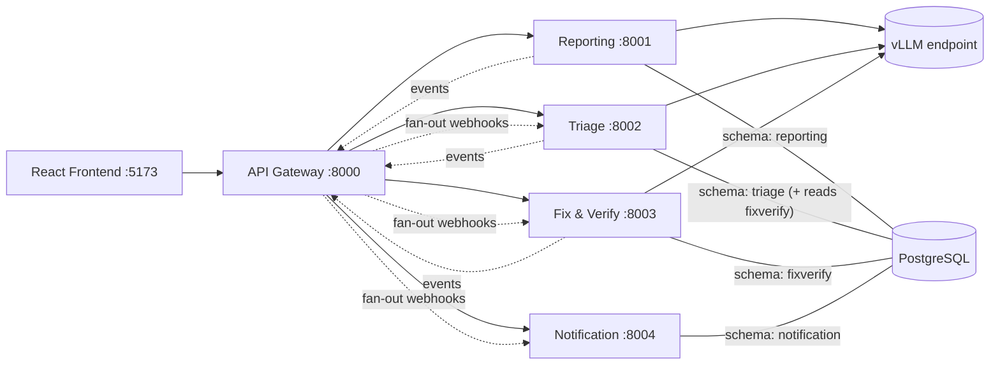

# 01 — Architecture

## Service map

## Services

### Gateway (`services/gateway`, :8000)
- Reverse-proxies `/api/reporting/*`, `/api/triage/*`, `/api/fixverify/*`,
  `/api/notifications/*` to the owning service (strips the prefix).
- **Event bus**: services `POST /events` with `{event_type, payload}`; the gateway
  fans each event out to the subscriber URLs in `app/subscriptions.py`.
  Delivery is best-effort with retries; a failed webhook is logged, not queued
  durably (PoC trade-off — a broker would replace this in production).
- Aggregated `/health` across all services.

### Reporting (`services/reporting`, :8001) — *source of truth for issues*
- Issue CRUD + status lifecycle. Every status transition is validated against the
  state machine and recorded in `issue_events` (timeline).
- **Smart categorization**: on create, calls the vLLM text model with the
  description; stores `ai_suggested_category` + confidence alongside the
  reporter's `category`. If they differ, the reporter is shown the suggestion and
  can accept it (one PATCH) — the user's input is never silently replaced.
- Emits: `issue.created`, `issue.updated`, `issue.status_changed`, `issue.closed`.

### Triage (`services/triage`, :8002)
- Subscribes to `issue.created` → runs the triage pipeline automatically:
  severity + urgency suggestion (LLM + rules), duplicate detection, then
  PATCHes the reporting service with results and emits `issue.triaged`.
- Analytics endpoints over a local snapshot of issue facts (refreshed from
  reporting on demand): systemic-fault clusters, MTBF, MTTR, location profile,
  issue profile, equipment extraction. Details in doc 05.

### Fix & Verify (`services/fixverify`, :8003)
- Subscribes to `issue.triaged` → creates a work order.
- Evidence recommendation endpoint (LLM): what proof suits this issue
  (photos, before/after readings, audio) and whether it is visually verifiable
  at all (`requires_human_verification`).
- Proof upload (multipart) → vLLM vision model checks relevance against the
  issue description → the proof is *staged* with its verdict and reason, and the
  uploader decides whether to put it forward (`POST /proofs/{id}/submit`) or
  discard it. The verdict never blocks; admin sign-off is the real gate.
- Human verification endpoint → PATCHes issue status in reporting, emits
  `proof.accepted` / `proof.rejected` / `issue.verified`.
- Files stored on local disk under `data/uploads/` (PoC).

### Notification (`services/notification`, :8004)
- Subscribes to **all** events; maps each event type to zero or more
  notifications targeted at a role (`reporter`, `maintenance`, `admin`) and/or a
  named user.
- Inbox API: list, unread count, mark read.

## Communication rules

1. **Queries and commands are sync REST** — e.g., triage PATCHes reporting to
   write severity; fixverify GETs an issue's description before a vision check.
2. **State changes are announced as events** via the gateway fan-out; consumers
   must be idempotent (events carry an `event_id`).
3. **Only reporting writes issue state.** Other services request changes through
   reporting's API so the state machine is enforced in one place.
4. **One PostgreSQL DB, one schema per service.** Each service writes only its
   own schema. Triage additionally holds read-only access to the `fixverify`
   schema for triage analytics (docs/02, docs/05).
5. Every service exposes `/health` and `/docs` (OpenAPI).

## Event catalog

| Event | Producer | Consumers |
|---|---|---|
| `issue.created` | reporting | triage (auto-triage), notification |
| `issue.triaged` | triage | fixverify (create work order), notification, reporting (already patched via REST) |
| `issue.escalated` | triage | notification (admin: a cluster crossed the systemic threshold; payload is cluster-shaped, with no `issue_id`) |
| `issue.status_changed` | reporting | notification |
| `work_order.started` | fixverify | notification |
| `proof.uploaded` | fixverify | notification (tell admin if it passed relevance) |
| `proof.rejected` | fixverify | notification (tell uploader + reason) |
| `issue.verified` | fixverify | notification (ask reporter to confirm closure) |
| `issue.closed` | reporting | triage (refresh metrics), notification |

## Demo-mode identity

No login. The role picker in the frontend's sidebar footer sets two headers on
every request: `X-User: <display name>`, `X-Role: reporter|maintenance|admin`.
Swapping in real auth later means replacing the header extraction dependency
(`get_current_user`) in each service.

Three services read them, for different reasons:

| Service | Uses the headers for |
|---|---|
| reporting | Attribution (`reporter_name`, event actors) **and read scoping** — `resolve_scope()` restricts `GET /issues` and `GET /stats/dashboard` to what the role may see: a reporter only issues they reported; maintenance only `in_progress`, `pending_verification`, `verified`, `closed`, `cancelled` (`config.MAINTENANCE_STATUSES`); an admin everything. |
| notification | Inbox targeting (`target_role` / `target_user`). |
| fixverify, triage | Attribution only (proof uploader, verifier, admin override). |

Scoping lives in one function so the issue list and the dashboard aggregates
over it cannot describe different populations. It is **not** authorization —
there is no server-side enforcement of who may call what, and the headers are
self-asserted. It is there so each role's screens show a coherent slice.
