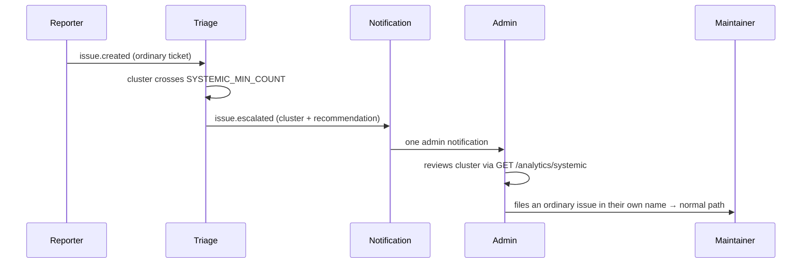
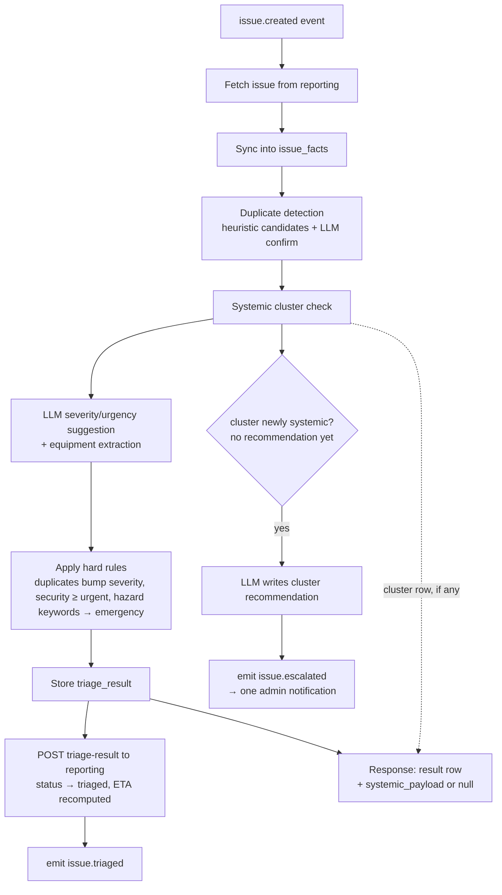

# 05 — Triage & Analytics

The triage service keeps a denormalized snapshot (`issue_facts`) of all issues,
refreshed from the reporting service on `issue.created` / `issue.closed` events
and via `POST /analytics/sync`. All macro-level analysis runs on this snapshot,
never on reporting's live DB.

## Systemic-fault detection (macro level)

Goal: surface deeper root problems that individual tickets hide.

1. **Cluster key**: `category | building | floor`. Equipment is deliberately
   not part of the key — `cluster_key` is unique, so adding it later is a
   migration, and equipment names are too sparse to cluster on today.
2. A cluster is flagged **systemic** when it accumulates
   `SYSTEMIC_MIN_COUNT` (default 3) issues within `SYSTEMIC_WINDOW_DAYS`
   (default 90).
3. For each flagged cluster the LLM produces a **preventive / prescriptive
   maintenance recommendation**, e.g. *"4 lighting failures on Block A Level 3 in
   6 weeks — likely a shared ballast/circuit fault; inspect the distribution
   board rather than replacing tubes individually."*
4. New issues landing in a flagged cluster get `systemic_flag=true` in their
   triage result and continue their normal lifecycle. The recommendation itself
   never enters the issue's own fields — it comes back beside them in
   `systemic_payload` (next section). The cluster's
   `issue_count` and `last_seen` are refreshed on every run, so both are
   as-of `updated_at`, not live — a cluster whose window has rolled off keeps
   its last computed count until a new member arrives.

## One issue in, one result out

Triage answers exactly one question per call: *what happens to this issue.*
`POST /triage/run/{issue_id}`, `GET /triage/results/{issue_id}` and
`POST /triage/results/{issue_id}/confirm` all return the same single object —
the stored `triage.results` row plus one extra key.

| Part of the result | Scope | Read by |
|---|---|---|
| `suggested_severity`, `suggested_urgency`, `severity_rationale`, `equipment_extracted`, `duplicate_of_issue_id`, `duplicate_confidence` | this issue | reporting / fixverify — it drives the work order |
| `systemic_flag`, `systemic_cluster_id` | this issue's membership | triage — a pointer, not a finding |
| `systemic_payload` | the cluster this issue landed in | the admin — a planning decision, not a repair |

`systemic_payload` is `null` in the ordinary case, and cluster-shaped when the
cluster has a recommendation to give:

```json
"systemic_payload": {
  "cluster_id": "e41c8d70-55a2-4f19-b3c6-7d9e0a1f2b48",
  "cluster_key": "lighting|Block A|L3",
  "issue_count": 4,
  "window_days": 90,
  "recommendation": "Four lighting failures on Block A Level 3 in six weeks point at a shared ballast or circuit fault; inspect the distribution board rather than replacing tubes individually."
}
```

Why a nullable second key rather than more columns on the row:

- **Different subject.** Every other field describes one defect at one location.
  The recommendation describes a *group* of them and is identical for every
  member of the cluster — flattening it onto each issue copies one finding N
  times and invites N repairs of one root cause.
- **Different reader.** The issue fields are consumed by the dispatch path,
  which fixes a ticket. The payload is consumed by an admin, who decides whether
  to plan preventive work. A caller that only dispatches ignores one key instead
  of unpicking a blended object.
- **Null is an answer, not a missing field.** `systemic_flag` says *this issue
  sits in a flagged cluster*; `systemic_payload` says *and here is what to do
  about the cluster*. A cluster flagged this run whose LLM call has not landed
  yet reports the first and `null` for the second, rather than a shell with an
  empty `recommendation` (`app/payload.py::with_systemic` holds that rule and
  its self-check: `python3 payload.py`).
- **Nothing is stored twice.** The payload is composed at serialization time
  from the `systemic_clusters` row that `systemic_cluster_id` already points at.
  It is therefore as-of the cluster's `updated_at`, and costs no new column.

### `is_critical_system` is not a triage output

Whether a critical system (security, power, water) is involved is a *reason for
the severity*, not a parallel verdict: the LLM is asked to state it in
`severity_rationale`, where the admin reads it, instead of returning a second
boolean that no rule consumed and that never appeared on `triage.results`
anyway. Triage no longer sends it in the write-back; reporting still has the
column and now leaves it alone unless a caller sets it explicitly, so an
admin-set value survives a re-triage.

## Systemic escalation (admin-raised issue)

Triage does not create, draft, or hold anything for the admin. When a cluster
first crosses the threshold it **notifies the admin once**, with the LLM's
recommendation as the body. The admin decides what to do with it, and if the
answer is "raise this as work", they file an ordinary issue under their own name
through the normal reporter flow. Nothing about that issue is special afterwards:
it is triaged, gets a work order, and needs proof and verification like any other.



- **Emitted exactly once per cluster.** The event fires on the run that first
  writes `cluster.recommendation`, which is already a once-only latch
  (`if not cluster.recommendation`). No new column, and a failed LLM call simply
  retries on the next member rather than emitting a half-empty notification.
- **Payload is cluster-shaped**, not issue-shaped: `cluster_id`, `cluster_key`,
  `issue_count`, `window_days`, `recommendation` — the same object, from the
  same builder, that the triaged issue got back as its `systemic_payload`. There
  is no `issue_id` at this point — nothing exists in reporting — so the
  notification service needs its own case rather than the `payload.issue_id`
  fallback the other rules share.
- **No new endpoint.** `GET /analytics/systemic` already returns clusters with
  their recommendations; the notification points the admin at it.
- **Accepted cost**: the admin's issue lands in the same cluster it came from,
  inflating `issue_count` by one and slightly shortening that group's MTBF.
  Re-notification is not a risk, since `recommendation` is already set. There is
  no link back from the issue to the cluster, so triage cannot tell an
  admin-raised systemic issue from an ordinary report — deliberate, in exchange
  for zero new schema.

## Profiles

- **Location profile** (`GET /analytics/profiles?by=location`): issue counts,
  severity mix, open backlog and repeat-rate per building/floor.
- **Issue profile** (`by=category`): volume, trend (last 30d vs prior 30d),
  median resolution time, duplicate rate per category.
- **Equipment**: extracted `equipment_name` frequencies — which assets fail most.

## Metrics

### MTBF — Mean Time Between Failures
Signal for deeper root problems: a short MTBF for a cluster means the same thing
keeps breaking.

```
For a group g (category|location|equipment), order issues by created_at:
MTBF(g) = mean(created_at[i+1] - created_at[i])        # requires ≥ 2 issues
```

Reported in days, grouped by `category`, `building`, `floor`, or `equipment`.
Low MTBF + systemic flag ⇒ recommend preventive maintenance instead of repeat
repairs.

### MTTR — Mean Time To Repair
Signal on maintenance/vendor performance (speed; pair with proof-rejection rate
for quality).

```
MTTR(g) = mean(fixed_at - created_at)   over issues with fixed_at set
```

Also exposed: `MTTC` (mean time to close, `closed_at - created_at`) and the
verification overhead (`closed_at - fixed_at`).

### Quality signals (vendor performance beyond speed)
Served by `GET /analytics/vendor-performance`, which reads the `fixverify` schema
directly — the sanctioned read-only cross-schema access in the shared PostgreSQL DB:
- **Proof rejection rate**: rejected proofs / total proofs per assignee — AI
  relevance rejections plus human rejections.
- **Avg repair hours**: work order `started_at → completed_at` per assignee.
- **Resolved-on-arrival count**: dispatches where no work was needed (a signal
  for reporter education / self-service opportunities).
- **Reopen rate**: issues that went `verified → in_progress` (reporter dispute).

## Duplicate handling & the dispatch gate

Duplicates (same defect, different reporters) are linked via
`duplicate_group_id` (see doc 04 §4). Severity-bump rule: `duplicate_count ≥ 3`
bumps suggested severity one level — multiple reports indicate wider impact.
Duplicate issues stay open and visible to their own reporters (each reporter's
dashboard tracks their submission).

**One defect, one dispatch.** Fixverify's `issue.triaged` handler skips work
order creation when the issue is a duplicate whose group primary already has a
live work order (`fixverify/app/dedupe.py::is_covered_by_primary`) — the
duplicate rides the primary's dispatch instead of sending maintenance out twice.
A primary whose work order is already `verified` or `rejected` is finished, so a
fresh report against it is treated as a recurrence and does get its own work
order.

The gate has a known consequence: a gated issue stays at `triaged` with no work
order of its own, and nothing closes it when the primary is resolved (see below).
For the PoC an admin closes it via the status API.

## Known gaps (as built)

Recorded so they are not rediscovered during implementation. Neither is fixed.

- **`duplicate_count` counts candidates, not confirmed duplicates.**
  `pipeline._find_duplicate` sets `group_size = len(candidates) + 1` when *any*
  candidate is confirmed, where `candidates` is the trigram pre-filter's top 5 —
  so it counts unrelated issues at the same location. That number feeds the
  `duplicate_count >= 3` severity bump in `_apply_hard_rules` and is posted to
  reporting as `duplicate_count`. One genuine duplicate plus two unrelated
  same-location issues silently bumps severity a level.
- **`issue.escalated` is not emitted yet.** The section above describes the
  intended behaviour; `pipeline._systemic_check` writes `cluster.recommendation`
  but publishes nothing, and `notification/app/rules.py` has no case for the
  event. What is built is the payload itself — every triage result in a flagged
  cluster now returns it — so the remaining work is the publish call and the
  notification rule, with nothing left to design about the shape. Until then an
  admin sees a cluster by opening a triaged issue or `GET /analytics/systemic`,
  not by being told.
- **Duplicate groups do not resolve together.** `duplicate_group_id` now gates
  dispatch (above), but nothing closes the other members when the primary is
  resolved. A gated duplicate sits at `triaged` until an admin closes it by hand.
  The fix is a rule in reporting on `issue.closed` — deliberately not built yet,
  because it needs a decision on whether the group closes with the primary or
  each reporter still confirms their own ticket.

## Triage pipeline (per issue)



The escalation branch is a side effect, not a gate: the triggering issue proceeds
down `I → J` regardless, and nothing in the pipeline waits on the admin. The
dotted edge is serialization, not a step — the payload is read back out of the
cluster row when the response is built, whether or not this run wrote it, so an
issue triaged into a long-standing cluster returns one too. Any
issue the admin subsequently files re-enters at `A` as an ordinary
`issue.created`.

Admins can re-run the pipeline or override severity/urgency on the triage board;
overrides are kept for measuring AI suggestion accuracy over time. A re-run
appends another `triage.results` row rather than replacing the previous one.

### Example result

`POST /api/triage/run/{issue_id}` for the 4th lighting report on Block A / L3 —
the run that tips the cluster over `SYSTEMIC_MIN_COUNT`. The response is the
stored `triage.results` row serialized whole, plus the cluster payload:

```json
{
  "id": "b6f2c1a4-9d3e-4a77-8c21-5e0f7a2b91dd",
  "issue_id": "3f9a7c02-1b4d-4e88-9a10-2c6d5b8e4f31",
  "suggested_severity": "medium",
  "suggested_urgency": "routine",
  "severity_rationale": "A corridor light out affects circulation but involves no critical system and poses no safety or security risk.",
  "equipment_extracted": "ceiling light",
  "duplicate_of_issue_id": null,
  "duplicate_confidence": null,
  "systemic_flag": true,
  "systemic_cluster_id": "e41c8d70-55a2-4f19-b3c6-7d9e0a1f2b48",
  "admin_confirmed": false,
  "admin_override_severity": null,
  "admin_override_urgency": null,
  "created_at": "2026-09-01T04:12:33.481920+00:00",
  "systemic_payload": {
    "cluster_id": "e41c8d70-55a2-4f19-b3c6-7d9e0a1f2b48",
    "cluster_key": "lighting|Block A|L3",
    "issue_count": 4,
    "window_days": 90,
    "recommendation": "Four lighting failures on Block A Level 3 in six weeks point at a shared ballast or circuit fault; inspect the distribution board rather than replacing tubes individually."
  }
}
```

The issue's own answer is unchanged by the cluster: it is still a `medium` /
`routine` corridor light, and it is dispatched as one. The fourth report is what
made the cluster worth a recommendation, not what made the ticket worse.

Side effects of that single call:

1. `triage.issue_facts` — row upserted for the issue.
2. `triage.systemic_clusters` — `cluster_key: "lighting|Block A|L3"`,
   `issue_count: 4`, `last_seen` bumped, `recommendation` written for the first
   time on this run.
3. `triage.results` — the row above, appended.
4. `POST /issues/{id}/triage-result` to reporting:
   `{"severity": "medium", "urgency": "routine", "equipment_name": "ceiling light",
   "duplicate_group_id": null, "duplicate_count": 1}`. A failure here is logged,
   not raised — the local result stands even if the write-back does not.
5. `issue.escalated` published, because this run wrote `recommendation`
   (designed, not built — see Known gaps):
   `{"cluster_id": "e41c8d70-…", "cluster_key": "lighting|Block A|L3",
   "issue_count": 4, "window_days": 90, "recommendation": "…"}`.

Note `systemic_payload` is not a column on `triage.results`; it is read from
`triage.systemic_clusters` when the result is serialized, so the same call
tomorrow returns the same row with a fresher cluster count.
