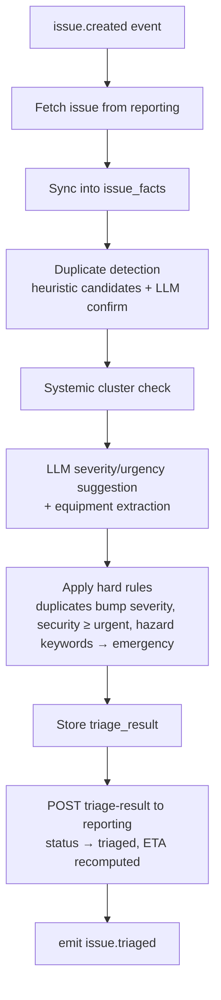

# 05 — Triage & Analytics

The triage service keeps a denormalized snapshot (`issue_facts`) of all issues,
refreshed from the reporting service on `issue.created` / `issue.closed` events
and via `POST /analytics/sync`. All macro-level analysis runs on this snapshot,
never on reporting's live DB.

## Systemic-fault detection (macro level)

Goal: surface deeper root problems that individual tickets hide.

1. **Cluster key**: `category | building | floor` (and `equipment_name` when
   present).
2. A cluster is flagged **systemic** when it accumulates
   `SYSTEMIC_MIN_COUNT` (default 3) issues within `SYSTEMIC_WINDOW_DAYS`
   (default 90).
3. For each flagged cluster the LLM produces a **preventive / prescriptive
   maintenance recommendation**, e.g. *"4 lighting failures on Block A Level 3 in
   6 weeks — likely a shared ballast/circuit fault; inspect the distribution
   board rather than replacing tubes individually."*
4. New issues landing in a flagged cluster get `systemic_flag=true` in their
   triage result, which the admin sees on the triage board.

## Profiles

- **Location profile** (`GET /analytics/profiles?by=location`): issue counts,
  severity mix, open backlog and repeat-rate per building/floor.
- **Issue profile** (`by=category`): volume, trend (last 30d vs prior 30d),
  median resolution time, duplicate rate per category.
- **Equipment**: extracted `equipment_name` frequencies — which assets fail most.

## Metrics

### MTBF — Mean Time Between Failures
Signal for deeper root problems: a short MTBF for a cluster means the same thing
keeps breaking.

```
For a group g (category|location|equipment), order issues by created_at:
MTBF(g) = mean(created_at[i+1] - created_at[i])        # requires ≥ 2 issues
```

Reported in days, grouped by `category`, `building`, `floor`, or `equipment`.
Low MTBF + systemic flag ⇒ recommend preventive maintenance instead of repeat
repairs.

### MTTR — Mean Time To Repair
Signal on maintenance/vendor performance (speed; pair with proof-rejection rate
for quality).

```
MTTR(g) = mean(fixed_at - created_at)   over issues with fixed_at set
```

Also exposed: `MTTC` (mean time to close, `closed_at - created_at`) and the
verification overhead (`closed_at - fixed_at`).

### Quality signals (vendor performance beyond speed)
Served by `GET /analytics/vendor-performance`, which reads the `fixverify` schema
directly — the sanctioned read-only cross-schema access in the shared PostgreSQL DB:
- **Proof rejection rate**: rejected proofs / total proofs per assignee — AI
  relevance rejections plus human rejections.
- **Avg repair hours**: work order `started_at → completed_at` per assignee.
- **Resolved-on-arrival count**: dispatches where no work was needed (a signal
  for reporter education / self-service opportunities).
- **Reopen rate**: issues that went `verified → in_progress` (reporter dispute).

## Duplicate handling & escalation

Duplicates (same defect, different reporters) are linked via
`duplicate_group_id` (see doc 04 §4). Escalation rule: `duplicate_count ≥ 3`
bumps suggested severity one level — multiple reports indicate wider impact.
Duplicate issues stay open and visible to their own reporters (each reporter's
dashboard tracks their submission); resolution of the group's primary issue
resolves the group.

## Triage pipeline (per issue)



Admins can re-run the pipeline or override severity/urgency on the triage board;
overrides are kept for measuring AI suggestion accuracy over time.
