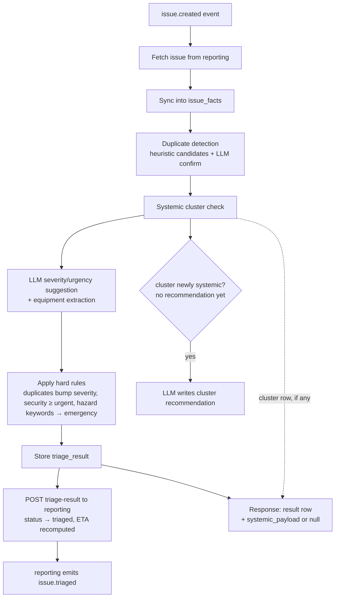

# 05 — Triage & Analytics

The triage service keeps a denormalized snapshot (`issue_facts`) of all issues,
refreshed from the reporting service on `issue.created`, `issue.status_changed`
and `issue.closed` events, and via `POST /analytics/sync`. Anything that moves an
issue's state re-syncs the whole fact — a status the snapshot never hears about
goes on counting as open work in `profiles()` and as an open duplicate candidate
in `_find_duplicate`, which is why cancellation publishes an event too.

All macro-level analysis runs on this snapshot, never on reporting's live DB.

## Systemic-fault detection (macro level)

Goal: surface deeper root problems that individual tickets hide.

1. **Cluster key**: `category | building | floor`. Equipment is deliberately
   not part of the key — `cluster_key` is unique, so adding it later is a
   migration, and equipment names are too sparse to cluster on today.
2. A cluster is flagged **systemic** when it accumulates
   `SYSTEMIC_MIN_COUNT` (default 3) issues within `SYSTEMIC_WINDOW_DAYS`
   (default 90).
3. For each flagged cluster the LLM produces a **preventive / prescriptive
   maintenance recommendation**, e.g. *"4 lighting failures on Block A Level 3 in
   6 weeks — likely a shared ballast/circuit fault; inspect the distribution
   board rather than replacing tubes individually."*
4. New issues landing in a flagged cluster get `systemic_flag=true` in their
   triage result and continue their normal lifecycle. The recommendation itself
   never enters the issue's own fields — it comes back beside them in
   `systemic_payload` (next section). The cluster's
   `issue_count` and `last_seen` are refreshed on every run, so both are
   as-of `updated_at`, not live — a cluster whose window has rolled off keeps
   its last computed count until a new member arrives.
5. **Clusters decay.** `GET /analytics/systemic` therefore returns two counts
   per cluster: the stored `issue_count`, which is what the detector saw when a
   member last arrived, and `issue_count_live`, recounted over the current
   window on every request, with `active` for whether it still clears
   `SYSTEMIC_MIN_COUNT`. The list is ranked on the live count. Without it a
   cluster someone remediated in March still tops the admin's list in
   September, because nothing ever revisits a cluster that stopped accruing
   members — and *stopped accruing members* is exactly what a fixed root cause
   looks like from here.

## One issue in, one result out

Triage answers exactly one question per call: *what happens to this issue.*
`POST /run/{issue_id}`, `GET /results/{issue_id}` and
`POST /results/{issue_id}/confirm` all return the same single object —
the stored `triage.results` row plus one extra key. (Service-local paths; the
gateway mounts them under `/api/triage/*`. The routes carry no `/triage` prefix
of their own — that produced `/api/triage/triage/results/{id}` from outside.)

| Part of the result | Scope | Read by |
|---|---|---|
| `suggested_severity`, `suggested_urgency`, `severity_rationale`, `equipment_extracted`, `duplicate_of_issue_id`, `duplicate_confidence` | this issue | reporting / fixverify — it drives the work order |
| `systemic_flag`, `systemic_cluster_id` | this issue's membership | triage — a pointer, not a finding |
| `systemic_payload` | the cluster this issue landed in | the admin — a planning decision, not a repair |

`systemic_payload` is `null` in the ordinary case, and cluster-shaped when the
cluster has a recommendation to give:

```json
"systemic_payload": {
  "cluster_id": "e41c8d70-55a2-4f19-b3c6-7d9e0a1f2b48",
  "cluster_key": "lighting|Block A|L3",
  "issue_count": 4,
  "window_days": 90,
  "recommendation": "Four lighting failures on Block A Level 3 in six weeks point at a shared ballast or circuit fault; inspect the distribution board rather than replacing tubes individually.",
  "issues": [
    {"issue_id": "…", "reference_no": "ISS-0041", "created_at": "2026-07-19T…",
     "status": "closed", "severity": "medium", "description": "Corridor light flickering outside room 3-12"},
    {"issue_id": "…", "reference_no": "ISS-0052", "created_at": "2026-08-04T…",
     "status": "closed", "severity": "low", "description": "Two tubes out near the lift lobby"},
    {"issue_id": "…", "reference_no": "ISS-0067", "created_at": "2026-08-21T…",
     "status": "in_progress", "severity": "medium", "description": "Lights out again on L3 east"},
    {"issue_id": "…", "reference_no": "ISS-0074", "created_at": "2026-09-01T…",
     "status": "triaged", "severity": "medium", "description": "Ceiling light not working in the L3 corridor"}
  ]
}
```

`issues` is the evidence behind the sentence. A count on its own is
unfalsifiable — an admin told "4 lighting failures" cannot see whether those are
one ballast or four unrelated fittings, and equipment is deliberately not part of
the cluster key, so that is exactly the judgement they are left to make. Each
member carries enough to make it and no more.

Why a nullable second key rather than more columns on the row:

- **Different subject.** Every other field describes one defect at one location.
  The recommendation describes a *group* of them and is identical for every
  member of the cluster — flattening it onto each issue copies one finding N
  times and invites N repairs of one root cause.
- **Different reader.** The issue fields are consumed by the dispatch path,
  which fixes a ticket. The payload is consumed by an admin, who decides whether
  to plan preventive work. A caller that only dispatches ignores one key instead
  of unpicking a blended object.
- **Null is an answer, not a missing field.** `systemic_flag` says *this issue
  sits in a flagged cluster*; `systemic_payload` says *and here is what to do
  about the cluster*. A cluster flagged this run whose LLM call has not landed
  yet reports the first and `null` for the second, rather than a shell with an
  empty `recommendation` (`app/payload.py::with_systemic` holds that rule and
  its self-check: `python3 payload.py`).
- **Nothing is stored twice.** The payload is composed at serialization time:
  the recommendation from the `systemic_clusters` row `systemic_cluster_id`
  already points at, the members from a fresh query on the same cluster key.
  No new column, and no second copy to drift.
- **The count *is* the list.** `issue_count` in the payload is `len(issues)`
  from that one query, so the number and the evidence cannot disagree. It is a
  live view: the 90-day window slides, so a cluster reports the members it has
  now, and one whose window has rolled off reports fewer than the
  `SYSTEMIC_MIN_COUNT` that flagged it. `SystemicCluster.issue_count` keeps the
  detector's number — the two answer different questions and are expected to
  diverge. `GET /analytics/systemic` returns both, as `issue_count` and
  `issue_count_live` (above).

### `is_critical_system` is not a triage output

Whether a critical system (security, power, water) is involved is a *reason for
the severity*, not a parallel verdict: the LLM is asked to state it in
`severity_rationale`, where the admin reads it, instead of returning a second
boolean that no rule consumed and that never appeared on `triage.results`
anyway. Triage no longer sends it in the write-back; reporting still has the
column and now leaves it alone unless a caller sets it explicitly, so an
admin-set value survives a re-triage.

## Systemic escalation is not triage's job

Triage detects the cluster, writes the recommendation, and hands both back in
`systemic_payload`. It does not create, draft, hold, or notify anything for the
admin — it publishes no events at all (the gateway routes `issue.created`,
`issue.status_changed` and `issue.closed` *to* triage; nothing goes the other
way, and the service has no `GATEWAY_URL`).

**Where the line has since moved.** `GET /analytics/insights` ranks clusters —
with trends, asset MTBF and proof-rejection rates — and decides which clear a
threshold worth an admin's attention. That is a *read-time* judgement over data
triage already owns, in the same class as `/analytics/systemic`, and it keeps
the thresholds in one curl-testable place instead of in a client. Triage still
pushes nothing: no events, no notifications, no drafts. The push side of
escalation, below, remains unowned and unbuilt.

Escalation — deciding a cluster is worth someone's attention and telling them —
is a separate concern with a separate owner, and the payload is the whole of the
interface between them. Whoever takes it on reads `systemic_payload` off a
triage result, or polls `GET /analytics/systemic`; either way triage does not
change. Design notes for that owner, kept here because they fall out of how the
cluster is stored:

- **Once per cluster comes free.** `cluster.recommendation` is written under
  `if not cluster.recommendation`, so the run that first sets it is identifiable
  and happens exactly once. A failed LLM call leaves it null and retries on the
  next member rather than escalating a half-empty cluster — which is also why
  `systemic_payload` is null until the recommendation lands.
- **The payload is cluster-shaped, not issue-shaped**: `cluster_id`,
  `cluster_key`, `issue_count`, `window_days`, `recommendation`, `issues`.
  There is no top-level `issue_id` — no issue exists for the *cluster* — so any
  consumer keyed on `payload.issue_id` needs its own case. `issues[]` carries
  the members, which is what a notification would link to.
- **Nothing new to read from.** `GET /analytics/systemic` returns every cluster
  with its recommendation, and `GET /analytics/insights` returns the ranked,
  card-shaped read of them with the decayed ones marked. A notifier needs
  neither a new endpoint nor a new column.
- **A cluster's recommendation is written once and not refreshed.** It reflects
  the members present when it crossed the threshold; a cluster that later grows
  to 30 issues still carries the advice written at 3. `issues` and the payload's
  `issue_count` are live, so a reader can at least see that the prose is out of
  date — which is half the point of returning the evidence and not only the
  sentence.

If the admin acts on a cluster by filing an ordinary issue, that issue lands in
the same cluster it came from, inflating `issue_count` by one and slightly
shortening the group's MTBF. There is no link back from an issue to the cluster
that prompted it, so triage cannot tell an admin-raised systemic issue from an
ordinary report — deliberate, in exchange for zero new schema.

## Profiles

`GET /analytics/profiles?by=location|category|equipment` returns, per group
(`building|floor`, `category`, or `equipment_name`):

| Field | Over | Meaning |
|---|---|---|
| `total`, `open`, `severity_mix` | whole snapshot | size and shape of the backlog |
| `duplicate_rate` | whole snapshot | share of the group's issues that arrived as a duplicate of an earlier one — read off `issue_facts.duplicate_group_id` |
| `recent`, `prior`, `trend_pct` | `window_days` and the window before it | is this getting worse |
| `repeat_rate` | `window_days` | share of the window's issues that are not the first of their category in this group |

Two windows in one row, and both are labelled. `total` answers *how much has this
place ever produced*; a rate needs a period or it only ever drifts towards
whatever the building has always been like, so the trend and repeat figures use
`analytics.TREND_WINDOW_DAYS` (30) and report it back as `window_days`.

`trend_pct` is `null` against an empty prior window rather than 0% or infinity —
no baseline is not the same as no change. `repeat_rate` is degenerate for
`by=category`, where the group *is* one category and every issue after the first
counts as a repeat; it means something for `by=location` and `by=equipment`.

`duplicate_rate` reads a column on `issue_facts` rather than counting
`triage.results` rows, because results are append-only and a re-run would
double-count. Reporting is still the writer of record for the link: the pipeline
mirrors onto the fact what it posts back, since nothing reporting publishes on
the write-back returns to triage, and existing rows fill in on their next sync
or immediately via `POST /analytics/sync`.

## Metrics

### MTBF — Mean Time Between Failures
Signal for deeper root problems: a short MTBF for a cluster means the same thing
keeps breaking.

```
For a group g (category|location|equipment), take one issue per duplicate group
(the oldest member), order by created_at:
MTBF(g) = mean(created_at[i+1] - created_at[i])        # requires ≥ 2 failures
```

Reported in days, grouped by `category`, `building`, `floor`, or `equipment`.
Low MTBF + systemic flag ⇒ recommend preventive maintenance instead of repeat
repairs.

**Duplicates are collapsed first, because a duplicate is the same defect
reported again, not the asset failing again.** Counting the confirmations
collapses MTBF towards the reporting interval: four colleagues raising one warm
FCU on consecutive days reads as an asset failing every day, which inverts the
number's meaning — a well-reported fault looks like the least reliable asset in
the building. The primary is the oldest member, the same choice
`grouping.pick_primary` makes, so a group contributes exactly one failure at the
time it was first reported.

### MTTR — Mean Time To Repair
Signal on maintenance/vendor performance (speed; pair with proof-rejection rate
for quality).

```
MTTR(g) = mean(fixed_at - created_at)   over issues with fixed_at set
```

Also exposed per group:

- `mttc_days` — mean time to close, `closed_at - created_at`.
- `median_repair_days` — `statistics.median` over the same repairs `mttr_days`
  averages. A mean is one abandoned ticket away from being useless; the median
  is what a reporter should actually expect to wait.
- `verification_overhead_days` — `mean(closed_at - fixed_at)` over the issues
  that have *both* stamps: how long a finished repair waits on proof and
  sign-off. Computed directly, not as `mttc_days - mttr_days` — those two means
  are taken over different sets of issues, so the subtraction is only correct
  when every repaired issue also closed.

### Quality signals (vendor performance beyond speed)
Served by `GET /analytics/vendor-performance`, which reads the `fixverify` schema
directly — the sanctioned read-only cross-schema access in the shared PostgreSQL DB:
- **Proof rejection rate**: rejected proofs / total proofs per assignee — AI
  relevance rejections plus human rejections.
- **Avg repair hours**: work order `started_at → completed_at` per assignee.
- **Resolved-on-arrival count**: dispatches where no work was needed (a signal
  for reporter education / self-service opportunities).
- **Reopen rate**: issues that went `verified → in_progress` (reporter dispute).

## Duplicate handling & the dispatch gate

Duplicates (same defect, different reporters) are linked via
`duplicate_group_id` (see doc 04 §4). Severity-bump rule: `duplicate_count ≥ 3`
bumps suggested severity one level — multiple reports indicate wider impact.
Duplicate issues stay open and visible to their own reporters (each reporter's
dashboard tracks their submission).

**The group primary is the oldest member, not the closest match.** A pg_trgm
pre-filter picks the five most similar open issues at the location and the LLM
confirms each one; `grouping.pick_primary` then takes the earliest `created_at`
of the confirmations (`python3 grouping.py`). Ranking by similarity instead
would let a duplicate name another duplicate as its primary — and that primary,
riding someone else's work order, has none of its own, so fixverify's gate looks
up `WorkOrder.issue_id == group_id`, finds nothing, and dispatches anyway.
Oldest is the original report, so every member of a group converges on the same
primary and chains cannot form. `grouping.cluster_key` is likewise the one
formula for a cluster's key, shared by the per-issue check and the live counts
in `analytics.systemic_clusters` so the two cannot drift.

**`duplicate_count` counts confirmations, plus this issue.** Every candidate is
put to the LLM rather than stopping at the first hit, because the number is what
it costs: it feeds the bump rule above and is posted to reporting. The
no-duplicate path already scanned all five candidates, so only the found-early
case loses its short-circuit. Confidence is compared against
`config.DUPLICATE_MIN_CONFIDENCE`.

**One defect, one dispatch.** Fixverify's `issue.triaged` handler skips work
order creation when the issue is a duplicate whose group primary already has a
live work order (`fixverify/app/dedupe.py::is_covered_by_primary`) — the
duplicate rides the primary's dispatch instead of sending maintenance out twice.
A primary whose work order is already `verified` or `rejected` is finished, so a
fresh report against it is treated as a recurrence and does get its own work
order.

The gate has a known consequence: a gated issue stays at `triaged` with no work
order of its own, and nothing closes it when the primary is resolved (see below).
For the PoC an admin closes it via the status API.

## Insights: the admin-facing read of all of the above

`GET /analytics/insights` composes the four aggregates into one ranked list of
recommendation cards, so an admin has a single screen to look at rather than
four endpoints to correlate. Live findings sort above decayed ones, then by
weight of evidence.

| Card `kind` | Raised when | `action` is |
|---|---|---|
| `systemic` | a stored cluster still clears `SYSTEMIC_MIN_COUNT` in the window | the cluster's stored LLM recommendation |
| `predictive` | a location's `trend_pct` ≥ 50% on ≥ 3 recent issues | templated: look for the single asset behind the rise |
| `pre-emptive` | asset MTBF < 60 days on ≥ 3 failures; or a location's `repeat_rate` ≥ 0.5 on ≥ 3 recent issues; or an assignee's `proof_rejection_rate` ≥ 0.5 on ≥ 3 proofs | templated: root-cause inspection, standing fault, or send the evidence recommendation with the dispatch |

Three properties are deliberate:

- **`repeat_rate` cards are location-only.** For `by=category` the rate is
  degenerate — the group *is* one category, so every issue after the first
  counts (see Profiles) — and a card built on it would fire everywhere.
- **No confidence score and no cost figure.** Nothing in the system produces
  either. A card carries counts, rates and windows that a reader can follow back
  to `linked[]`, which is the same argument as returning the cluster's evidence
  rather than only its sentence.
- **`filter` says how to find the card's issues** (`{search, category}`).
  Stated server-side because this is the side that knows the group: a systemic
  card's `id` is a cluster UUID, and `cluster_key` is not safely parseable back
  into fields.

## Known gaps (as built)

Recorded so they are not rediscovered during implementation.

- ~~**Nobody escalates a cluster.**~~ **Since addressed.**
  `GET /analytics/insights` assembles clusters — alongside location trends,
  asset MTBF and proof-rejection rates — into ranked recommendation cards, and
  the frontend's AI insights page (admin) is their reader. An admin no longer
  has to open a triaged issue or call `/analytics/systemic` to learn about one.
  A card carries the cluster's stored recommendation as its action, its live and
  at-detection counts as evidence, and `active: false` when the cluster has
  stopped accruing members. Still no *push*: nothing publishes
  `issue.escalated`, so this is a screen an admin visits, not a notification
  that arrives.
- **Duplicate groups do not resolve together.** `duplicate_group_id` now gates
  dispatch (above), but nothing closes the other members when the primary is
  resolved. A gated duplicate sits at `triaged` until an admin closes it by hand.
  The fix is a rule in reporting on `issue.closed` — deliberately not built yet,
  because it needs a decision on whether the group closes with the primary or
  each reporter still confirms their own ticket.
- **A cluster's `first_seen` and the duplicate link are never re-derived.** Both
  are written once and left. A re-triage that finds a different primary
  overwrites triage's own copy but not reporting's, which only ever sets
  `duplicate_group_id` and never clears it. Harmless at PoC scale, and the cost
  of keeping reporting the single writer of issue state.

## Triage pipeline (per issue)



The cluster branch is a side effect, not a gate: the triggering issue proceeds
down `H → I → J` regardless, and the pipeline waits on nobody. The dotted edge is
serialization, not a step — the payload is read back out of the cluster row when
the response is built, whether or not this run wrote it, so an issue triaged into
a long-standing cluster returns one too.

Note who emits what: triage publishes nothing. `issue.triaged` is published by
reporting when it accepts the write-back at `I`, and the pipeline ends at `N`
with a returned result — there is no escalation arrow out of this diagram, by
design (above).

Admins can re-run the pipeline or override severity/urgency on the triage board;
overrides are kept for measuring AI suggestion accuracy over time. A re-run
appends another `triage.results` row rather than replacing the previous one.

### Example result

`POST /api/triage/run/{issue_id}` for the 4th lighting report on Block A / L3 —
the run that tips the cluster over `SYSTEMIC_MIN_COUNT`. The response is the
stored `triage.results` row serialized whole, plus the cluster payload:

```json
{
  "id": "b6f2c1a4-9d3e-4a77-8c21-5e0f7a2b91dd",
  "issue_id": "3f9a7c02-1b4d-4e88-9a10-2c6d5b8e4f31",
  "suggested_severity": "medium",
  "suggested_urgency": "routine",
  "severity_rationale": "A corridor light out affects circulation but involves no critical system and poses no safety or security risk.",
  "equipment_extracted": "ceiling light",
  "duplicate_of_issue_id": null,
  "duplicate_confidence": null,
  "systemic_flag": true,
  "systemic_cluster_id": "e41c8d70-55a2-4f19-b3c6-7d9e0a1f2b48",
  "admin_confirmed": false,
  "admin_override_severity": null,
  "admin_override_urgency": null,
  "created_at": "2026-09-01T04:12:33.481920+00:00",
  "systemic_payload": {
    "cluster_id": "e41c8d70-55a2-4f19-b3c6-7d9e0a1f2b48",
    "cluster_key": "lighting|Block A|L3",
    "issue_count": 4,
    "window_days": 90,
    "recommendation": "Four lighting failures on Block A Level 3 in six weeks point at a shared ballast or circuit fault; inspect the distribution board rather than replacing tubes individually.",
    "issues": ["… the four members, oldest first, as shown above …"]
  }
}
```

The issue's own answer is unchanged by the cluster: it is still a `medium` /
`routine` corridor light, and it is dispatched as one. The fourth report is what
made the cluster worth a recommendation, not what made the ticket worse.

Side effects of that single call:

1. `triage.issue_facts` — row upserted for the issue.
2. `triage.systemic_clusters` — `cluster_key: "lighting|Block A|L3"`,
   `issue_count: 4`, `last_seen` bumped, `recommendation` written for the first
   time on this run.
3. `triage.results` — the row above, appended.
4. `POST /issues/{id}/triage-result` to reporting:
   `{"severity": "medium", "urgency": "routine", "equipment_name": "ceiling light",
   "duplicate_group_id": null, "duplicate_count": 1}` — the count is confirmed
   duplicates plus one, so an issue with no confirmed duplicate posts 1 no
   matter how full the candidate pre-filter was. A failure here is logged,
   not raised — the local result stands even if the write-back does not.
5. Nothing is published. The recommendation this run wrote leaves in the
   response, as `systemic_payload` above, and nowhere else.

Note `systemic_payload` is not a column on `triage.results`. Its recommendation
is read from `triage.systemic_clusters` and its members from a fresh query when
the result is serialized, so the same `GET` tomorrow returns the same immutable
row with a current member list — including the fifth report, if one arrives
tonight. `triage.systemic_clusters.issue_count` still reads 4: that is what the
detector saw.
